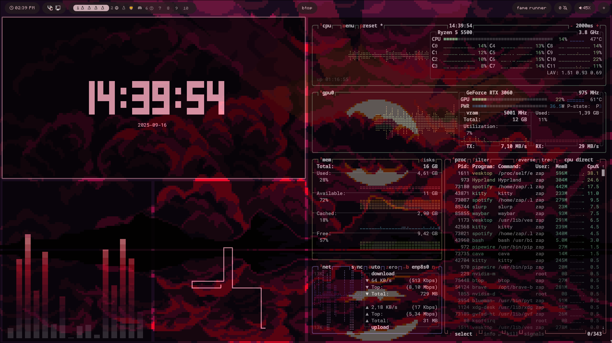

# Dotfiles
My hyprland dots (mix of JaKooLit and binnewbs) for me to restore on a new system
You shouldn't use this as it's not the "nicest" setup, however i like this alot, wallpapers were gathered from various places therefore i've decided not to post them.

# Installation

To install, run the commands below

WARNING: This will replace your current configuration
```shell
sudo pacman -S sddm hyprland rofi-wayland swww kitty waybar cliphist playerctl pavucontrol wl-clipboard xdg-desktop-portal-hyprland git vim
systemctl enable sddm.service
git clone https://github.com/zaaaappp/dots.git
sudo cp -r dots/.config/ ~/.config/
sudo reboot now
```

# Configuration
If you are on a Nvidia GPU, make sure you've [configured](https://wiki.hypr.land/Nvidia/) hyprland correctly.

Otherwise please edit "~/.config/hypr/hyprland.conf", and comment out/remove
"env = LIBVA_DRIVER_NAME,nvidia" and 
"env = __GLX_VENDOR_LIBRARY_NAME,nvidia" near the top of the file

Next up, edit "~/.config/monitors.conf" and adjust it to your [monitors](https://wiki.hypr.land/Configuring/Monitors/), You can access the keybinds in ~/.config/monitors.conf and adjust it to your monitors.


# Pictures
Shows cava, btop, tty clock, and pipes.



(colors sync with your wallpaper)

# Credits
╺╸[JaKooLit](https://github.com/JaKooLit/Hyprland-Dots) for most of the files.  
╺╸[Binnewbs](https://github.com/binnewbs/arch-hyprland) for the waybar configuration.
