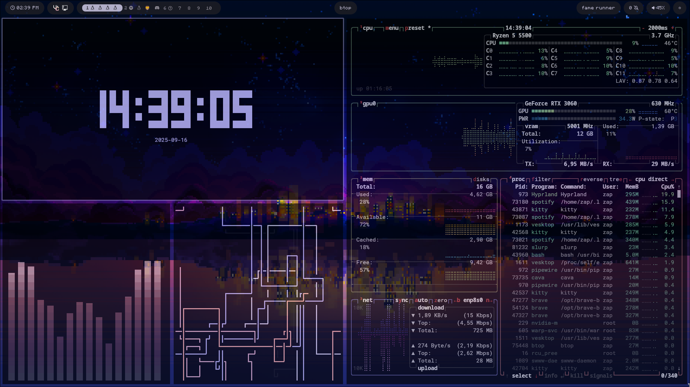

# Dotfiles
My hyprland dots (mix of jakoolit and binnewbs) to restore on a new system
You shouldn't use this as it's not the "nicest" setup, however i like this alot,

# Credits
╺╸[JaKooLit](https://github.com/JaKooLit/Hyprland-Dots) for most of the files.  
╺╸[Binnewbs](https://github.com/binnewbs/arch-hyprland) for the Waybar configuration.

(colors automatically sync with your wallpaper)
